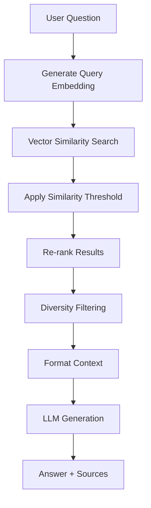

# 🧠 RAG Knowledge Assistant

A production-ready **Retrieval-Augmented Generation (RAG)** system that enables users to upload documents and ask questions answered **only** from the uploaded content. Built with FastAPI, FAISS vector database, and OpenAI embeddings.

## 🚀 Features

- **Document Upload**: Support for text and markdown files
- **Vector Search**: FAISS-powered similarity search with cosine similarity
- **RAG Pipeline**: Manual implementation with clear separation of concerns
- **Source Citations**: Every answer includes referenced document chunks
- **Clean API**: RESTful endpoints with comprehensive error handling
- **Modern UI**: Simple, responsive web interface
- **Production Ready**: Typed models, logging, health checks, and persistence

## 🏗️ Architecture Overview

### RAG Pipeline Architecture

```
┌─────────────┐    ┌──────────────┐    ┌─────────────┐
│  Document   │    │   Chunking   │    │ Embeddings  │
│   Upload    │───▶│  & Overlap   │───▶│  (OpenAI)   │
└─────────────┘    └──────────────┘    └─────────────┘
                                               │
                                               ▼
┌─────────────┐    ┌──────────────┐    ┌─────────────┐
│  Question   │    │   Retrieval  │    │ FAISS Vector│
│   & Query   │───▶│  & Ranking   │◀───│  Database   │
└─────────────┘    └──────────────┘    └─────────────┘
                           │
                           ▼
                   ┌─────────────┐
                   │ LLM Response│
                   │  (OpenAI)   │
                   └─────────────┘
```

### Component Breakdown

#### 1. **Document Ingestion** (`rag/ingest.py`)
- **Text Extraction**: Supports .txt, .md files (PDF extraction ready)
- **Smart Chunking**: Overlap-based chunking with sentence/word boundary detection
- **Metadata Tracking**: Document IDs, chunk indices, character positions

#### 2. **Vector Embeddings** (`rag/embeddings.py`)
- **Provider Abstraction**: Easy swap between embedding providers
- **Batch Processing**: Efficient API usage with configurable batch sizes
- **OpenAI Integration**: text-embedding-ada-002 model (1536 dimensions)

#### 3. **Vector Database** (`vectordb/faiss_store.py`)
- **FAISS Implementation**: IndexFlatIP for cosine similarity
- **Persistence**: Automatic save/load to disk
- **Metadata Storage**: Chunk information alongside vectors
- **Search & Filtering**: Similarity threshold and result limiting

#### 4. **Retrieval System** (`rag/retrieve.py`)
- **Similarity Search**: Cosine similarity with normalized vectors
- **Re-ranking**: Keyword-based scoring boost
- **Diversity Filtering**: Avoid redundant similar chunks
- **Configurable Parameters**: Max chunks, similarity thresholds

#### 5. **Prompt Engineering** (`rag/prompt.py`)
- **Strict Prompting**: Forces LLM to use only provided context
- **Context Building**: Formats retrieved chunks with source references
- **Source Extraction**: Maintains traceability to original documents

### How Vector Search Works

1. **Embedding Generation**: Documents are split into chunks and converted to 1536-dimensional vectors
2. **Storage**: Vectors stored in FAISS index with associated metadata
3. **Query Processing**: User questions are embedded using the same model
4. **Similarity Search**: Cosine similarity finds most relevant chunks
5. **Re-ranking**: Additional scoring based on keyword overlap
6. **Context Assembly**: Top chunks formatted for LLM consumption

### How RAG Retrieval Works



## 📁 Project Structure

```
rag-knowledge-assistant/
├── backend/
│   ├── main.py                 # FastAPI application entry point
│   ├── api/
│   │   ├── __init__.py
│   │   └── endpoints.py        # API routes (upload, query, health)
│   ├── rag/
│   │   ├── __init__.py
│   │   ├── ingest.py          # Document processing & chunking
│   │   ├── embeddings.py      # Embedding generation (OpenAI)
│   │   ├── retrieve.py        # Vector search & retrieval
│   │   ├── prompt.py          # LLM prompting & response generation
│   │   └── pipeline.py        # Main RAG orchestration
│   ├── vectordb/
│   │   ├── __init__.py
│   │   └── faiss_store.py     # FAISS vector database implementation
│   ├── models/
│   │   ├── __init__.py
│   │   ├── schemas.py         # Pydantic models for API
│   │   └── config.py          # Configuration & settings
│   ├── utils/
│   │   └── __init__.py
│   └── requirements.txt       # Python dependencies
├── frontend/
│   ├── index.html             # Main UI
│   ├── styles.css             # Clean, modern styling
│   └── app.js                 # Frontend application logic
├── env.example                # Environment configuration template
└── README.md                  # This file
```

## 🛠️ Setup Instructions

### Prerequisites

- **Python 3.8+**
- **OpenAI API Key** ([Get one here](https://platform.openai.com/api-keys))

### 1. Clone and Setup

```bash
# Clone the repository
git clone <repository-url>
cd rag-knowledge-assistant

# Create virtual environment
python -m venv venv

# Activate virtual environment
# On Windows:
venv\Scripts\activate
# On macOS/Linux:
source venv/bin/activate

# Install dependencies
cd backend
pip install -r requirements.txt
```

### 2. Configuration

```bash
# Copy environment template
cp env.example .env

# Edit .env with your configuration
# At minimum, add your OpenAI API key:
OPENAI_API_KEY=your-api-key-here
```

### 3. Run the Application

```bash
# From the backend directory
python main.py

# Or using uvicorn directly
uvicorn main:app --reload --host 127.0.0.1 --port 8000
```

The application will be available at:
- **Frontend**: http://127.0.0.1:8000
- **API Documentation**: http://127.0.0.1:8000/docs
- **Alternative API Docs**: http://127.0.0.1:8000/redoc

## 📖 Usage Guide

### Web Interface

1. **Upload Documents**
   - Click "Upload Document" and select .txt or .md files
   - Documents are automatically processed into searchable chunks
   - View statistics showing documents, chunks, and vectors

2. **Ask Questions**
   - Enter your question in the text area
   - Adjust max chunks (1-20) and similarity threshold (0-1)
   - Get answers with source citations showing exact document chunks

3. **Manage Knowledge Base**
   - View statistics about your uploaded content
   - Clear all documents when needed
   - Monitor system health status

### API Usage

#### Upload a Document

```bash
curl -X POST "http://127.0.0.1:8000/api/v1/upload" \
     -H "accept: application/json" \
     -H "Content-Type: multipart/form-data" \
     -F "file=@document.txt"
```

#### Query the Knowledge Base

```bash
curl -X POST "http://127.0.0.1:8000/api/v1/query" \
     -H "accept: application/json" \
     -H "Content-Type: application/json" \
     -d '{
       "question": "What is the main topic of the document?",
       "max_chunks": 5,
       "similarity_threshold": 0.7
     }'
```

#### Check System Health

```bash
curl -X GET "http://127.0.0.1:8000/api/v1/health"
```

### Example Response

```json
{
  "answer": "Based on the provided context, the main topic is...",
  "sources": [
    {
      "document_id": "uuid-here",
      "filename": "document.txt",
      "chunk_index": 0,
      "similarity_score": 0.89,
      "content_preview": "This document discusses..."
    }
  ],
  "retrieved_chunks": 3,
  "processing_time_ms": 1250
}
```

## 🔧 Configuration Options

### Environment Variables

| Variable | Default | Description |
|----------|---------|-------------|
| `OPENAI_API_KEY` | *Required* | Your OpenAI API key |
| `OPENAI_EMBEDDING_MODEL` | `text-embedding-ada-002` | Embedding model to use |
| `OPENAI_CHAT_MODEL` | `gpt-3.5-turbo` | Chat completion model |
| `VECTOR_DB_PATH` | `./data/vector_db` | Vector database storage path |
| `CHUNK_SIZE` | `1000` | Document chunk size in characters |
| `CHUNK_OVERLAP` | `200` | Overlap between chunks |
| `DEFAULT_MAX_CHUNKS` | `5` | Default chunks to retrieve |
| `DEFAULT_SIMILARITY_THRESHOLD` | `0.7` | Default similarity threshold |

### Chunking Strategy

The system uses an intelligent chunking approach:

1. **Character-based chunks** with configurable size and overlap
2. **Boundary detection** to avoid splitting sentences/words
3. **Metadata preservation** for accurate source references
4. **Overlap handling** to maintain context between chunks

### Vector Database

- **FAISS IndexFlatIP**: Exact similarity search with inner product
- **Normalized vectors**: Enables cosine similarity calculation
- **Persistent storage**: Automatic save/load from disk
- **Metadata integration**: Chunk information stored alongside vectors

## 🧪 Testing

```bash
# Install test dependencies
pip install pytest pytest-asyncio

# Run tests (if test files are created)
pytest tests/

# Test API endpoints
curl -X GET "http://127.0.0.1:8000/api/v1/health"
```

## 📊 Performance Considerations

### Scaling Guidelines

- **Documents**: Tested with hundreds of documents
- **Chunk size**: 1000 characters balances context and precision
- **Embedding batches**: 100 texts per API call for efficiency
- **FAISS performance**: Excellent for datasets up to millions of vectors

### Optimization Tips

1. **Chunk size tuning**: Smaller chunks (500-800) for precise answers, larger (1200-1500) for context
2. **Similarity threshold**: Lower (0.6) for broader search, higher (0.8) for precision
3. **Re-ranking**: Enable for better result quality
4. **Diversity filtering**: Prevents redundant similar chunks

## 🚀 Future Improvements

### Planned Features

- [ ] **PDF Support**: Direct PDF text extraction
- [ ] **Multiple File Formats**: DOCX, RTF support
- [ ] **Hybrid Search**: Combine vector and keyword search
- [ ] **Advanced Re-ranking**: Machine learning-based scoring
- [ ] **User Sessions**: Multiple knowledge bases per user
- [ ] **Document Management**: Edit, update, and version control
- [ ] **Analytics**: Query patterns and usage statistics

### Advanced RAG Techniques

- [ ] **Query Expansion**: Automatic query enhancement
- [ ] **Context Compression**: Intelligent context summarization
- [ ] **Multi-hop Reasoning**: Chain of thought for complex queries
- [ ] **Source Validation**: Confidence scoring for retrieved chunks

## 🐛 Troubleshooting

### Common Issues

1. **OpenAI API Key Error**
   ```
   Solution: Ensure OPENAI_API_KEY is set in .env file
   ```

2. **Vector Database Not Found**
   ```
   Solution: Check VECTOR_DB_PATH permissions and disk space
   ```

3. **Empty Search Results**
   ```
   Solution: Lower similarity threshold or check document content
   ```

4. **Memory Issues**
   ```
   Solution: Reduce chunk size or implement batch processing
   ```

### Logging

The application uses structured logging:
```python
# Enable debug logging
DEBUG=true in .env file
```

## 📄 License

This project is provided as-is for educational and development purposes. Please review OpenAI's usage policies when using their APIs.

## 🤝 Contributing

This is a production-ready template. Contributions welcome for:
- Additional document format support
- Enhanced chunking strategies  
- Alternative embedding providers
- UI/UX improvements
- Performance optimizations

---

**Built with ❤️ for the RAG community**

*A complete, interview-ready RAG implementation demonstrating production best practices.*
